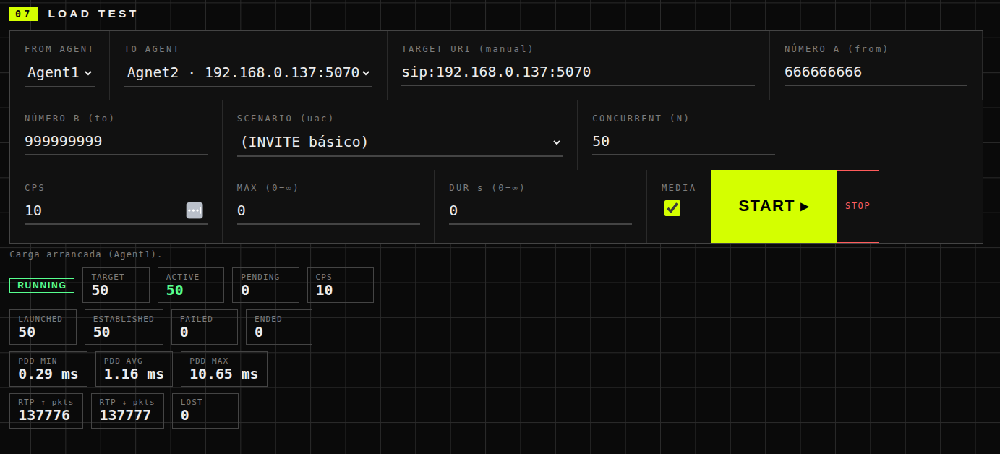
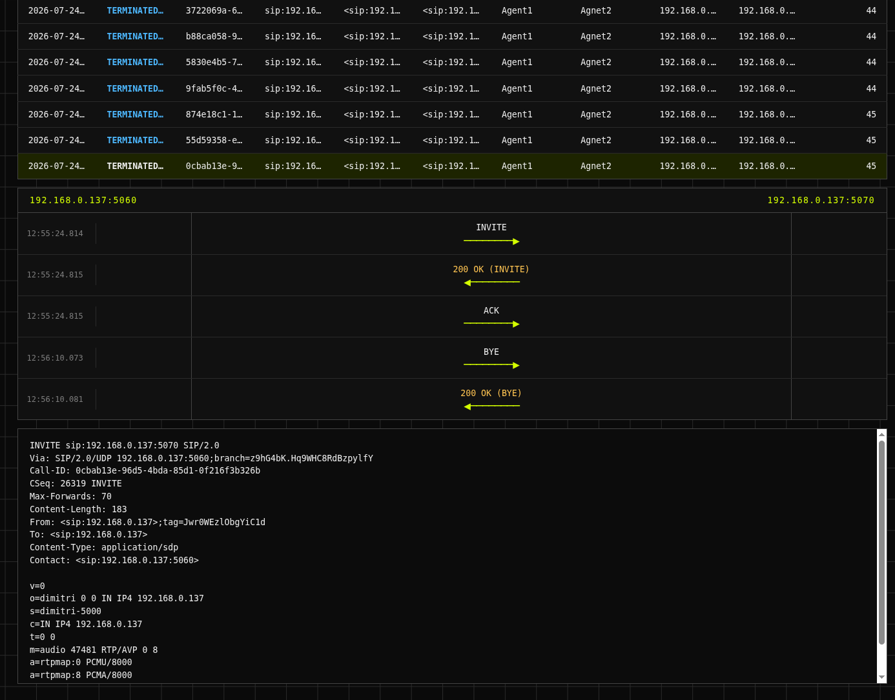
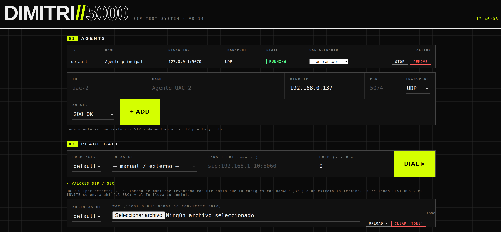
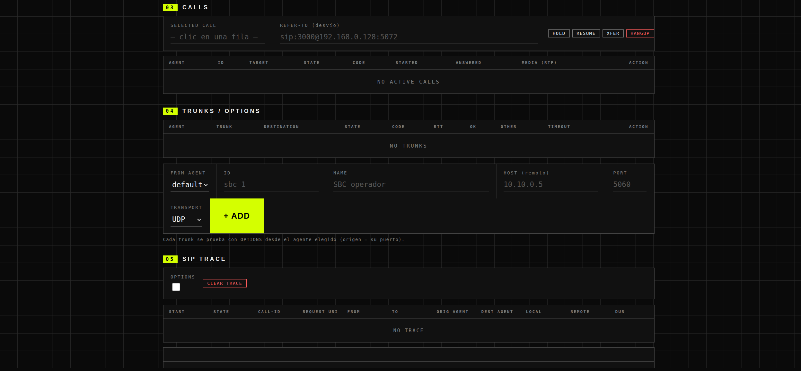
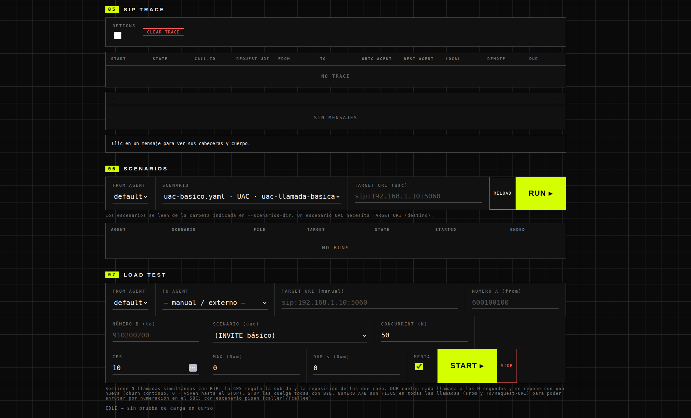

# dimitri-5000

*[English](README.md) · **Español***

**Prueba centralitas, troncales y SBCs de SIP/VoIP desde el navegador.** Lanza y
recibe llamadas con audio real, genera carga de miles de llamadas por segundo y
ve la traza SIP en un diagrama de escalera en vivo. Un único binario, sin
instalar nada.

[](https://go.dev)
[](LICENSE)


Una alternativa moderna a **SIPp**: la misma potencia para probar VoIP con
tráfico controlado, pero con escenarios en **YAML legible** en vez de XML y una
**web en tiempo real** en vez de una pantalla de ncurses.



<sub>Una prueba de carga en marcha: 50 llamadas concurrentes, PDD en vivo (INVITE→200 OK) y contadores de paquetes RTP.</sub>

#### De un vistazo

- 📞 **Llamadas reales** UAC/UAS con audio RTP (G.711), HOLD/RESUME y REFER.
- 🧪 **Escenarios en YAML** reproducibles, para el lado que llama y el que contesta.
- 🚀 **Pruebas de carga** de miles de cps con estadísticas en vivo (verificado a 2000 cps).
- 🔍 **Traza tipo SBC**: cada llamada, su diagrama de escalera y el mensaje en crudo.
- 🖥️ **Multi-agente** en una sola máquina, todo desde el navegador.

## ¿Qué puedes hacer con ella?

- **Lanzar llamadas** (UAC) y **recibirlas** (UAS), con identidades SIP
  realistas: From/To con número y dominio, P-Asserted-Identity, cabeceras
  arbitrarias… lo necesario para atravesar un SBC como lo haría una llamada real.
- **Audio de verdad**: media RTP con G.711, con métricas en vivo (paquetes,
  jitter, pérdida). Puedes enviar un tono o tu propio fichero WAV.
- **Controlar la llamada en curso**: colgar, poner en espera y reanudar
  (HOLD/RESUME con re-INVITE real) o desviarla (REFER).
- **Escenarios reproducibles** en YAML, estilo SIPp pero legibles: tanto del
  lado que llama (UAC) como del que contesta (UAS), con temporizaciones,
  respuestas opcionales y variables. Hay ejemplos en `examples/scenarios/`.
- **Pruebas de carga**: N llamadas a una tasa configurable (cps), cada una
  ejecutando un escenario completo, con estadísticas en vivo. Puedes fijar el
  número A (llamante) y el número B (llamado) desde el panel: todas las
  llamadas de la prueba salen con esa numeración (en el From y en el
  To/Request-URI), lista para enrutarla por número en tu SBC o PBX; si la
  carga usa un escenario, esos números pisan sus variables `{caller}` y
  `{callee}`.
- **Destinos reutilizables**: da de alta tu SBC o tu centralita una vez (nombre,
  IP, puerto, transporte y dominio del To) y elígelo luego en un desplegable
  para llamar, ejecutar escenarios o lanzar carga, sin volver a teclear la URI.
  El catálogo se guarda en el `config.json`, así que sigue ahí al reiniciar.
- **Monitorizar troncales** con OPTIONS: estado, código de respuesta y RTT de
  cada trunk, con umbral de fallos configurable.
- **Ver qué pasa por el cable**: visor de trazas tipo SBC con todas las
  llamadas (estado, duración, origen/destino) y, al pulsar una, su diagrama de
  escalera mensaje a mensaje; cada mensaje se puede abrir en crudo.
- **Varios agentes a la vez**: cada agente es una instancia SIP independiente
  (su IP, su puerto, su comportamiento al contestar), así puedes simular los
  dos extremos de una llamada en la misma máquina.

Todo esto vive en la interfaz web, organizada en 7 paneles: AGENTS, PLACE
CALL, CALLS, TRUNKS/DESTINATIONS, SIP TRACE, SCENARIOS y LOAD TEST.

## Capturas

**Traza SIP** — cada llamada, su diagrama de escalera y el mensaje en crudo con su SDP:



<details>
<summary><b>Más capturas</b> — agentes, lanzar llamada, troncales, escenarios</summary>

**01 AGENTS · 02 PLACE CALL** — cada agente es una instancia SIP independiente:



**03 CALLS · 04 TRUNKS/OPTIONS** — llamadas en vivo con HOLD/RESUME/XFER y monitorización de troncales:



**06 SCENARIOS · 07 LOAD TEST** — lanza un escenario YAML o úsalo como carga:



</details>

## Arranque rápido

Necesitas [Go 1.23+](https://go.dev/dl/). Desde la carpeta del proyecto:

```bash
# Linux / macOS
./run-web.sh
```

```powershell
# Windows
.\run-web.ps1
```

Abre `http://127.0.0.1:8080` y ya estás dentro. El script arranca en loopback
(SIP en 127.0.0.1:5070), que es perfecto para la primera toma de contacto:
crea un segundo agente en el panel AGENTS (por ejemplo en el puerto 5071),
lanza una llamada entre los dos desde PLACE CALL y mira la traza en SIP TRACE.

Para hablar con equipos reales (un Asterisk, un SBC…), edita las variables al
principio de `run-web.sh` / `run-web.ps1`: deja `BIND_IP` vacío para que
autodetecte la IP de tu tarjeta de red, y pon `WEB_ADDR` en `0.0.0.0:8080` si
quieres abrir la web desde otro equipo de la LAN.

Si prefieres el comando directo:

```bash
go run . --mode web --bind-ip "" --sip-port 5070 --web 127.0.0.1:8080
```

## Modos de ejecución

El modo `web` es el principal y el que querrás casi siempre. Los demás son
útiles para automatizar o para depurar sin navegador:

| Modo | Qué hace | Ejemplo |
|---|---|---|
| `web` | Estación de trabajo completa: agentes, llamadas, escenarios, carga y trazas desde el navegador | `go run . --mode web` |
| `uac` | Lanza UNA llamada, la mantiene un tiempo y cuelga | `go run . --mode uac --to sip:192.0.2.10:5060 --hold 10s` |
| `uas` | Se queda escuchando y contesta las llamadas entrantes | `go run . --mode uas --sip-port 5060 --answer-code 200` |
| `scenario` | Ejecuta un escenario YAML por CLI | `go run . --mode scenario --file examples/scenarios/uac-basico.yaml --to sip:192.0.2.30:5060` |
| `monitor` | Solo el faro de troncales (OPTIONS) + web de estado | `go run . --mode monitor --config config.json` |

`go run . --help` lista todos los flags (transporte UDP/TCP, dominio del From,
código de respuesta del UAS, tiempo de ringing…).

## Configuración

Para el modo monitor (o para fijar IP/puerto sin flags) puedes usar un JSON:

```bash
cp config.example.json config.json   # edítalo con tus IPs y troncales
go run . --config config.json
```

`config.json` está fuera del repositorio a propósito: suele contener IPs
internas. En modo `web` se usa para guardar el **catálogo de destinos** (los
que das de alta en el panel TRUNKS/DESTINATIONS): es lo único que persiste
entre arranques. Los agentes y la asignación de quién monitoriza qué viven en
memoria mientras la aplicación corre.

## Escenarios

Un escenario describe un flujo SIP como una secuencia de pasos. Este, por
ejemplo, es una llamada básica del lado que llama:

```yaml
name: uac-llamada-basica
role: uac

steps:
  - send: INVITE
  - recv: "100"
    optional: true
  - recv: "180"
    optional: true
  - recv: "200"
  - send: ACK
  - pause: 3s
  - send: BYE
  - recv: "200"
```

También puedes escribir el guion del lado que contesta (`role: uas`): cuánto
tarda en dar el 180, con qué código responde, cuándo cuelga. La referencia
completa del formato está en `SCENARIO_FORMAT.md`, y en `examples/scenarios/`
hay escenarios de ambos lados listos para usar. Los escenarios se ejecutan
desde la web (panel SCENARIOS), por CLI (`--mode scenario`) o como plantilla
de cada llamada en una prueba de carga.

## Compilar un binario

```bash
go build -ldflags "-s -w" -o dist/dimitri-5000 .
```

Sale un único ejecutable autocontenido (la web va embebida): se copia a la
máquina de destino y listo, sin instalar nada más. En `DESPLIEGUE.md` está el
detalle, incluida la compilación cruzada Windows ⇄ Linux.

## ¿Para quién es?

Técnicos de VoIP, QA y operadores que necesitan probar centralitas, troncales
y SBCs: validar flujos de llamada, medir comportamiento bajo carga y
reproducir incidencias sin pelearse con XML.

## Documentación

- `FICHA_TECNICA.md` — arquitectura, stack y plan por fases.
- `SCENARIO_FORMAT.md` — referencia del lenguaje de escenarios.
- `DESPLIEGUE.md` — cómo compilar y desplegar en Windows y Ubuntu.
- `HANDOFF.md` — diario de desarrollo: qué se ha hecho y qué queda.

## Licencia

Este proyecto se distribuye bajo la licencia **MIT** — Copyright (c) 2026
Jerónimo Mosquera. El texto completo está en [`LICENSE`](LICENSE).

### Dependencias de terceros

El motor SIP se apoya en **[sipgo](https://github.com/emiago/sipgo)** de Emir
Aganovic, distribuido bajo licencia **BSD 2-Clause**. Gracias a ese proyecto por
resolver la parte más difícil de la RFC 3261 (transacciones, retransmisiones,
diálogos y digest auth).

El resto de dependencias son igualmente permisivas y compatibles con MIT:

| Dependencia | Licencia |
|---|---|
| `github.com/emiago/sipgo` | BSD 2-Clause |
| `gopkg.in/yaml.v3` | MIT / Apache-2.0 |
| `github.com/gobwas/ws`, `gobwas/pool`, `gobwas/httphead` | MIT |
| `github.com/icholy/digest` | MIT |
| `github.com/kr/text` | MIT |
| `github.com/google/uuid` | BSD 3-Clause |
| `golang.org/x/sync`, `golang.org/x/sys` | BSD 3-Clause |

Los textos completos de licencia de cada dependencia están en
[`THIRD_PARTY_NOTICES.md`](THIRD_PARTY_NOTICES.md).
